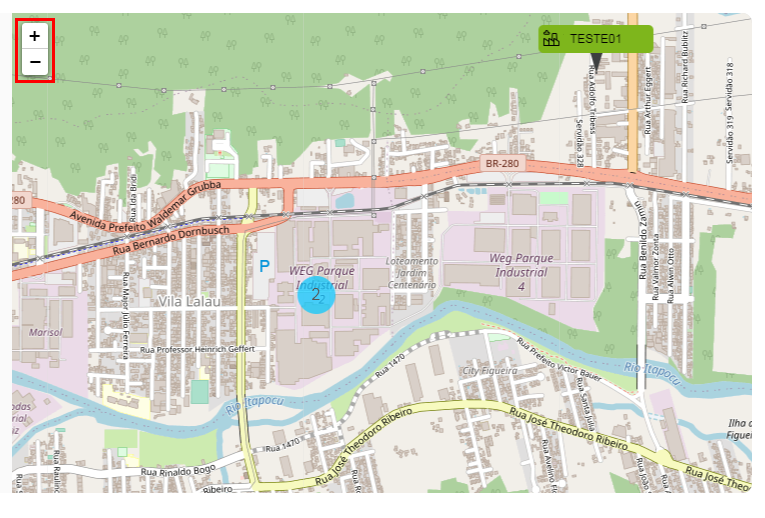

# Funcionalidades

Apresenta interface gráfica configurável, permitindo o cadastro de cada ativo com posicionamento geolocalizado ou por meio de plantas e imagens, onde os equipamentos, layout ou mesmo a planta toda pode ser incorporada com a importação de modelos. As seguintes funcionalidades estão disponíveis:

-	Organização hierárquica por meio de clientes, sites, plantas, agrupadores, ativos e seus sensores;
-	Agrupador de Drives, motores e outros dispositivos;
-	Tela para monitoramento do cliente, ou seja, do conjunto de sites e plantas;
-	Telas individuais, para monitoramento de planta;
-	Relatórios detalhados de eventos e desempenho;
-	Tela de painel de controle para cada ativo ou sensor.

Além disso, colabora para o monitoramento global de seus ativos em campo, capacidade de comparação de desempenho de diferentes aplicações, análise preditiva, acesso aos dados históricos da aplicação, conhecimento dos riscos, histórico de performance do equipamento para aprimoramento de produtos, possibilidade de reparos mais rápidos, conhecimento da localização (local) da instalação, além do acesso à informação 24 horas e 7 dias na semana de forma global. 

No ambiente gráfico, seleção de ativo específico por zoom, dados de status do ativo (rotação estimada, on/off, temperatura, vibração, outros...) são mostrados em ambiente gráfico.

