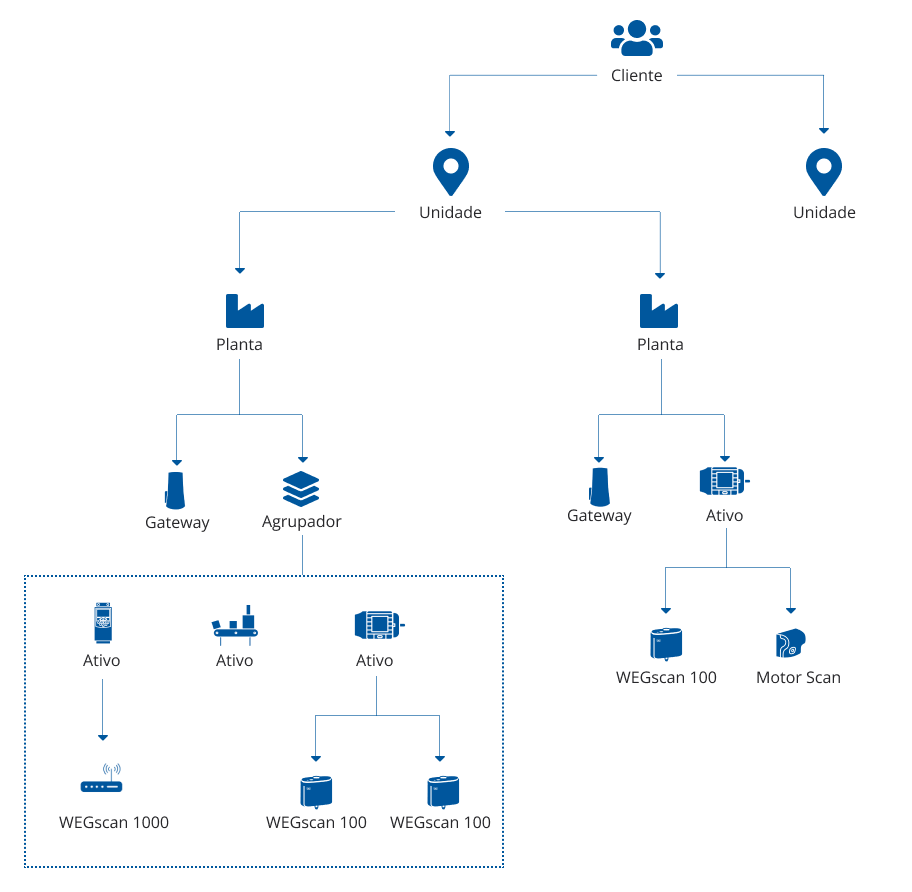

# Hierarquia

O WEG MFM possui diferentes níveis para melhor organização da sua frota. A hierarquia serve como ordenação de elementos em ordem de importância e função, categorizando cada constituinte. O WEG MFM permite o cadastro de até seis níveis desde “cliente” até o “sensor”, onde cada nível se liga aos outros conforme a figura abaixo:

-	Cliente - Conjunto de sites;
-	Unidade – Conjunto de plantas;
-	Planta - Instalação fabril;
-	Agrupador – Conjunto de ativos e sensores;
-	Ativo industrial - Tipo “Motor”, “Drive”, “Redutor”, entre outros;
-	Sensor – Tipo “Motor Scan”, “WEGscan 100”, “WEGscan 1000”, entre outros.
