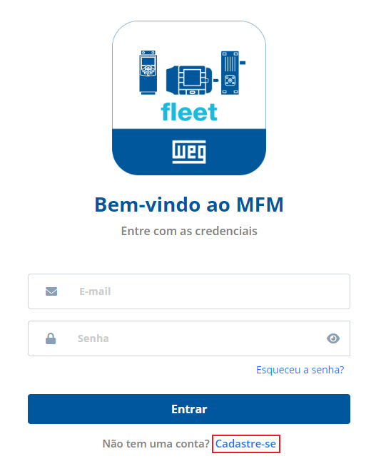
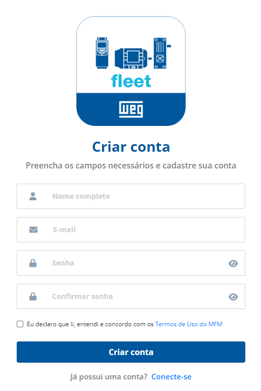

# Cadastro de conta

Abra seu navegador de preferência e acesse o endereço http://mfm.wnology.io/.

Clique em “Cadastre-se” para criar uma conta nova, conforme figura abaixo:

Informe seu nome completo, endereço de e-mail (certifique-se de que seja um endereço válido para possibilitar o envio do e-mail de confirmação), senha (deve possuir ao menos 10 caracteres) e repita a senha para confirmar, conforme a figura abaixo:

Para o cadastro, é necessária a leitura e o aceite dos “Termos de Uso do MFM”, disponíveis na parte inferior da tela de cadastro da conta. Clique em “Criar conta” para finalizar a criação de sua conta. 

Após a criação da conta, será enviado um e-mail de confirmação. Clique no link para validar o seu e-mail. Após isso, você será redirecionado para a tela de login da aplicação. 

